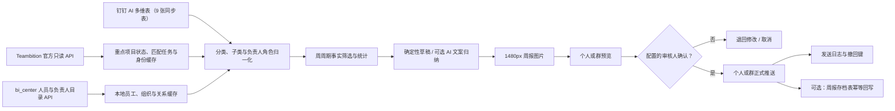

# 架构与数据口径

## 处理链路

## 来源表

| 表 | 表 ID | 视图用途 |
|---|---|---|
| 拜访交流记录 | `dEOVLJG` | 产品过程 |
| 市场招投标 | `0LDcV09` | 产品过程 |
| 产品策划分析调研 | `2zJbiQc` | 产品过程 |
| 重点项目跟踪 | `uRM5L3r` | 产品与项目过程 |
| 其他事项 | `qQdy02L` | 产品过程 |
| 产品管理事项 | `PoYFuV8` | 产品过程 |
| 支持及待办 | `37mCxrX` | 产品与项目过程 |
| 产品经理名单 | `VdXcedx` | 名单辅助 |
| 使用反馈记录 | `6YCHLaR` | 使用反馈与改进过程 |
| 周报存档 | `2m05o4u` | 不作为周报事实来源；正式发送成功后可选回写 |

Teambition 是重点项目的补充来源，不占用 AI 多维表 tableId。正式默认链路与 `bi_center` 正式容器一致，使用 Teambition native OpenAPI；dingtalk Project API 仅保留为兼容模式。客户端和 SQLite 表均在本服务内实现。系统先读取多维表“重点项目跟踪”，按项目名称调用项目查询接口，再用项目编号或 Unicode 规范化后的项目名称做唯一匹配；只有匹配项目的进度、项目状态和状态正文写入 `teambition_project`。任务缓存写入 `teambition_task` 仅供匹配项目看板使用，钉钉/TB 身份映射写入 `teambition_user_map`，同步结果写入 `teambition_sync_run`。TB 任务不再投影为独立周报事实。

字段使用中文字段名匹配，不依赖易变化的 fieldId。表结构发生调整时，采集会保留原始响应到 `raw_json`，但不会把运行数据提交到 Git。

汇总分类来自来源表配置，固定顺序为：客户拜访与交流、市场招投标、产品策划分析调研、重点项目跟踪、产品管理事项、支持及待办、其他事项、使用反馈与改进。TB 只补充“重点项目跟踪”的项目状态，不新增分类或项目。表内存在“交流方式、事项类型、类型、反馈类型”等字段时继续形成二级分类。团队汇总和个人周报共用同一份生成时事实快照，个人周报仅筛选负责人角色中命中的事项，不重新读取或改写源表。团队编辑可调整当前版本快照的业务字段和负责人；新负责人必须来自本地有效人员目录，保存时生成新版本，绝不回写 AI 表或 TB。

个人周报必须通过钉钉 SSO 获取当前 UserID：普通员工仅查看本人；部门或业务组负责人可查看其负责组织的主归属成员；公司负责人和配置的审核人可查看全部有效成员。运维令牌不能模拟个人身份。成员列表还会与当前周报事实中的负责人交集，避免暴露无关人员。

归档写入与来源采集分离：启用前必须配置语义键到精确 fieldId/字段名的映射，写入前重新读取表结构并转换为 fieldId。`archiveKey` 是必填幂等字段，格式为“周期 + 周报类型 + 版本”；重试先全表查找该键，命中则恢复本地归档状态而不新增记录。

## 纳入周报的条件

记录满足以下任一条件即纳入：业务日期在本周期、来源更新时间在本周期、本地快照在本周期发生变化、截止日期在周期结束后指定天数内且未完成、存在未关闭风险。重复原因只纳入一次。首次全量同步只建立基线，优先使用源更新时间作为变化时间，不把没有业务日期的历史记录批量伪装成本周变化。

AI 摘要默认不包含人员姓名，且只发送风险优先的有限事实；所有计数和完整事实清单均由本地程序产生。只有显式配置模型地址、密钥和模型名时才调用外部 AI。部署环境可从 `bi_center` 安全复制当前有效配置；管理页保存的覆盖值存入本服务 SQLite `app_config`，API Key 读取时始终脱敏。最近一次连接测试只保存模型身份、成功状态和错误摘要，不保存额外密钥。恢复沿用只删除本服务覆盖，不调用或修改 `bi_center`。

项目经理版优先使用“责任人”等项目负责人字段；`重点项目跟踪` 和 `支持及待办` 作为项目视图。若实际表中还有项目经理字段，可通过 `projectManagerFieldOverrides` 配置并在后续版本扩展验证。

TB 项目严格以多维表重点项目为白名单：项目编号精确匹配优先，其次是 Unicode NFKC 规范化后的项目名称精确匹配，只有唯一候选才建立关联。项目状态更新时间落在周报周期内时，该重点项目会进入本期周报；TB 标记为暂停、风险或紧急时会补充风险提示。执行人任务仍按研发体系七部门同步，但看板和周报范围只保留已匹配重点项目；父任务、归档/删除任务不进入看板。

人员覆盖口径：产品经理预期名单来自 `产品经理名单`；项目经理预期名单由 `projectManagerRoster` 和 `bi_center` 员工职位中的 `projectManagerTitleKeywords` 合并。生成周报时保存覆盖统计与缺失清单，提醒只能由管理员人工触发，并以“周期 + 角色 + UserID”幂等。

## 状态机

`draft_generated → rendered → awaiting_approval → approved → formal_sent`

旁路状态为 `need_changes`、`cancelled`、`superseded` 和 `retryable_error`。保存团队或个人内容时，服务复制当前综合版到新版本、复制个人覆盖、使旧版 `superseded` 并清除其可用审核；新版本的 `content_hash` 覆盖团队内容、快照、指标和个人覆盖，审核写入 `approved_content_hash`。正式发送必须同时满足“当前综合版、人工审核、两个哈希相等”。消息幂等键由“周报 ID + 阶段 + 目标类型 + 目标 + 消息类型”组成；发送前先在 SQLite 事务中占位，10 分钟内的并发重复调用会被阻断。

周末任务以 Asia/Shanghai 计算并使用各自 `job_status` 键：`weekend_sat09_test`、`weekend_sat17_final`、`weekend_sun20_formal`。任务重启后在 36 小时补偿窗口内重试失败的同一周期；未审核或版本已变化的周日任务记录 `skipped` 与原因，绝不发送。

归档有独立的 `pending/sent/error` 状态。只有周报进入 `formal_sent` 后才允许归档；归档失败不会回退正式发送状态。再次调用正式发送只重试归档，不会重复推送消息。

## 存储与恢复

SQLite 使用 WAL；`runtime/` 挂载持久卷。备份数据库文件和 `runtime/reports/` 即可恢复。启动时幂等增加周报事实快照、覆盖清单及归档状态字段，并为来源事实增加分类键、分类顺序、二级分类和负责人角色 JSON；已有周报保留原数据并在缺少快照时兼容读取当前源记录，新周报写入不可变事实快照。个人周报为快照派生视图，不新增业务数据表。模型覆盖和测试状态复用现有 `app_config` 表的 `ai_model`、`ai_model_test` 配置键，不新增表。

TB 接入新增四张 SQLite 表，不改动既有表结构。回滚旧镜像不会删除这些表，既有 AI 表事实、周报和推送日志不受影响；如需彻底移除，必须停服备份后再删除 `teambition_task`、`teambition_project`、`teambition_user_map`、`teambition_sync_run`，并清理 `source_record` 中 `table_id=teambition_tasks` 的投影数据。

人员目录同步会事务性刷新 `employee_cache`、`organization_cache` 和 `employee_org_relation_cache`。员工表保留检索所需的工号、主部门、业务组、任职状态和负责人标志；组织表保存部门/业务组的成员数和负责人数；关系表区分主归属与跨组织负责人范围，避免把兼任负责人错误归属到其主部门。旧数据库启动时通过幂等迁移增加员工列和两张缓存表。回滚旧镜像不会删除新增列或表；如需彻底物理回退，应停服备份 SQLite 后重建数据库副本，不建议直接删除列。
