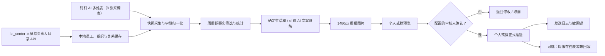

# 架构与数据口径

## 处理链路

## 来源表

| 表 | 表 ID | 视图用途 |
|---|---|---|
| 拜访交流记录 | `dEOVLJG` | 产品过程 |
| 市场招投标 | `0LDcV09` | 产品过程 |
| 产品策划分析调研 | `2zJbiQc` | 产品过程 |
| 重点项目跟踪 | `uRM5L3r` | 产品与项目过程 |
| 其他事项 | `qQdy02L` | 产品过程 |
| 产品管理事项 | `PoYFuV8` | 产品过程 |
| 支持及待办 | `37mCxrX` | 产品与项目过程 |
| 产品经理名单 | `VdXcedx` | 名单辅助 |
| 周报存档 | `2m05o4u` | 不作为周报事实来源；正式发送成功后可选回写 |

字段使用中文字段名匹配，不依赖易变化的 fieldId。表结构发生调整时，采集会保留原始响应到 `raw_json`，但不会把运行数据提交到 Git。

归档写入与来源采集分离：启用前必须配置语义键到精确 fieldId/字段名的映射，写入前重新读取表结构并转换为 fieldId。`archiveKey` 是必填幂等字段，格式为“周期 + 周报类型 + 版本”；重试先全表查找该键，命中则恢复本地归档状态而不新增记录。

## 纳入周报的条件

记录满足以下任一条件即纳入：业务日期在本周期、来源更新时间在本周期、本地快照在本周期发生变化、截止日期在周期结束后指定天数内且未完成、存在未关闭风险。重复原因只纳入一次。首次全量同步只建立基线，优先使用源更新时间作为变化时间，不把没有业务日期的历史记录批量伪装成本周变化。

AI 摘要默认不包含人员姓名，且只发送风险优先的有限事实；所有计数和完整事实清单均由本地程序产生。只有显式配置模型地址、密钥和模型名时才调用外部 AI。部署环境可从 `bi_center` 安全复制当前有效配置；管理页保存的覆盖值存入本服务 SQLite `app_config`，API Key 读取时始终脱敏。最近一次连接测试只保存模型身份、成功状态和错误摘要，不保存额外密钥。恢复沿用只删除本服务覆盖，不调用或修改 `bi_center`。

项目经理版优先使用“责任人”等项目负责人字段；`重点项目跟踪` 和 `支持及待办` 作为项目视图。若实际表中还有项目经理字段，可通过 `projectManagerFieldOverrides` 配置并在后续版本扩展验证。

人员覆盖口径：产品经理预期名单来自 `产品经理名单`；项目经理预期名单由 `projectManagerRoster` 和 `bi_center` 员工职位中的 `projectManagerTitleKeywords` 合并。生成周报时保存覆盖统计与缺失清单，提醒只能由管理员人工触发，并以“周期 + 角色 + UserID”幂等。

## 状态机

`draft_generated → rendered → awaiting_approval → approved → formal_sent`

旁路状态为 `need_changes`、`cancelled` 和 `retryable_error`。正式发送需要：审核状态正确、至少一个正式个人/群目标、人员缓存非空、图片已生成、公开签名链接可用。消息幂等键由“周报 ID + 阶段 + 目标类型 + 目标 + 消息类型”组成；发送前先在 SQLite 事务中占位，10 分钟内的并发重复调用会被阻断。

归档有独立的 `pending/sent/error` 状态。只有周报进入 `formal_sent` 后才允许归档；归档失败不会回退正式发送状态。再次调用正式发送只重试归档，不会重复推送消息。

## 存储与恢复

SQLite 使用 WAL；`runtime/` 挂载持久卷。备份数据库文件和 `runtime/reports/` 即可恢复。启动时幂等增加周报事实快照、覆盖清单及归档状态字段；已有周报保留原数据并在缺少快照时兼容读取当前源记录，新周报写入不可变事实快照。模型覆盖和测试状态复用现有 `app_config` 表的 `ai_model`、`ai_model_test` 配置键，不新增表。

人员目录同步会事务性刷新 `employee_cache`、`organization_cache` 和 `employee_org_relation_cache`。员工表保留检索所需的工号、主部门、业务组、任职状态和负责人标志；组织表保存部门/业务组的成员数和负责人数；关系表区分主归属与跨组织负责人范围，避免把兼任负责人错误归属到其主部门。旧数据库启动时通过幂等迁移增加员工列和两张缓存表。回滚旧镜像不会删除新增列或表；如需彻底物理回退，应停服备份 SQLite 后重建数据库副本，不建议直接删除列。
